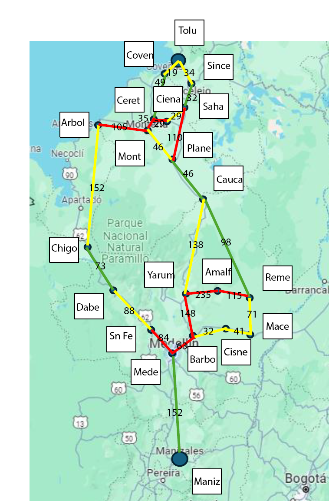

# Taller_IntroAI_AlgoritmosBusqueda
Taller Intro AI, Algoritmos de Busqueda

Link Repo: 
https://github.com/heldigard/Taller_IntroAI_AlgoritmosBusqueda

# Integrantes
Kelly Tatiana Alvarez 
Eldigardo Camacho

# Notas
* La Heuristica se realizó basándonos en el tiempo.
* Cada algoritmo esta resuelto en un notebook diferente.
* Se realizó la siguiente imagen para el cálculo de las Heuristicas, cada valor es tiempo en minutos.

